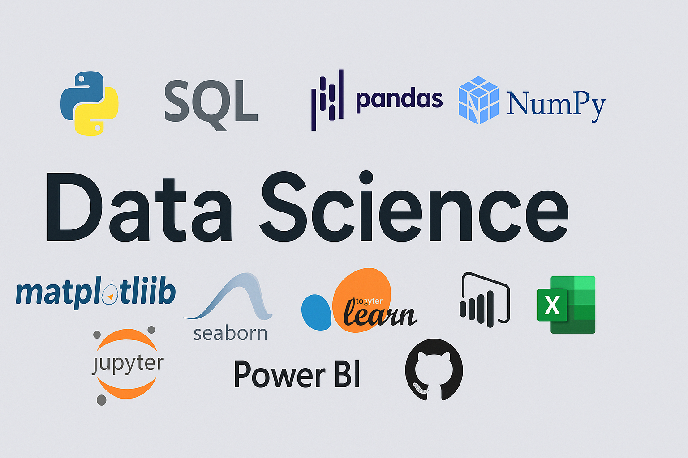

<!-- Banner-style Introduction -->
<h1 align="center">Hi there, I'm Wajiha Khanam 👋</h1>

  📈 Crunching Numbers | 🤖 Teaching Machines | 🎯 Solving Data Mysteries  

  

---

### 🧑‍💻 About Me

- 🎓 From engineering roots to uncovering insights through data 
- 🛠️ Skilled in **Python**, **SQL**, and **Statistics**
- 📊 Hands-on with **EDA**, **data cleaning**, and **dashboarding** in Power BI  
- 🚀 Firm believer in **learning by doing**, focused on solving real-world data problems
- 🔍 Currently exploring **Machine Learning** and **Deep Learning** to turn data into decisions 

---

## 🧰 Tools I Use

---

### 📈 GitHub Stats

  
  

  

  

---

### 📫 Let's Connect

  
  

---
